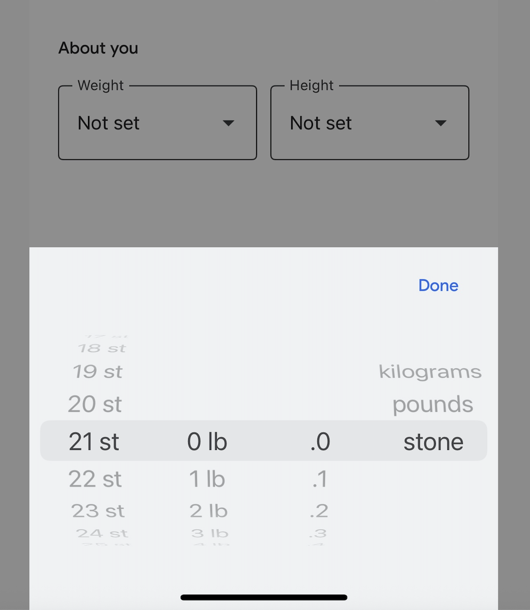

The `VirtualizedLists should never be nested inside plain ScrollViews with the same orientation` error is common in React Native. There are several workarounds online, but some cases do require rethinking the layout. 

In this article, I'll examine the root cause, review common technical fixes, and explain when the best solution is redesigning your layout, or consider non-JS based libraries.

<!-- <figure>
  
    <figcaption class="text-center">
    Photo by <a href="https://www.pexels.com/photo/brown-wooden-desk-159618/">Pixabay</a>
  </figcaption>
</figure> -->

## Table of contents

## What is a VirtualizedList?
A **VirtualizedList** is an optimised list component that renders only what’s visible (a technique known as *virtualisation*/*windowing*). This keeps memory usage low and scrolling smooth for large datasets.

- `FlatList` and `SectionList` are both built on **VirtualizedList**.  
- `ScrollView` is a simple container that **renders all children at once**.

In practice, you’ll get far less delay for long lists with `FlatList`/`SectionList` than with `ScrollView`.

## When will you see this error?
This error fires when a **VirtualizedList** (`FlatList` / `SectionList`) is nested inside another scroller with the **same scroll direction** — typically a parent `ScrollView` or another `VirtualizedList`.  

Different orientations are fine (e.g., a **vertical** list whose items contain **horizontal** carousels).

## Why does this error occur?
When same-orientation scrollers are nested:

- **Gesture/scroll ownership conflicts:** The framework can’t reliably decide whether the **parent** or the **child** should handle scroll/touch events, causing flaky interactions or unresponsive UIs.  
- **Competing viewport maths:** Both containers attempt their own layout/visibility calculations, which can lead to jank, extra memory pressure, and rendering glitches.

## Common Technical Solutions

### 1) Suppress the warning (dev-only)
Use `LogBox.ignoreLogs()` (or legacy `YellowBox.ignoreWarnings()`) to hide the message.  
**Note:** This will just quiet dev console but **does not** fix the actual problem. I would not recommend this in prod.

```ts
// RN ≥ 0.63
import { LogBox } from 'react-native';
LogBox.ignoreLogs([
  'VirtualizedLists should never be nested inside plain ScrollViews with the same orientation',
]);

// RN < 0.63 (deprecated)
import { YellowBox } from 'react-native';
YellowBox.ignoreWarnings([
  'VirtualizedLists should never be nested inside plain ScrollViews with the same orientation',
]);
```

### 2) Enable nested scrolling
**Android:** You can sometimes get away with setting `nestedScrollEnabled` on **both** the parent and the child. But some edge cases might still be broken.

```ts
<ScrollView nestedScrollEnabled>
  <FlatList
    nestedScrollEnabled
    data={data}
    keyExtractor={(x) => x.id}
    renderItem={renderItem}
  />
</ScrollView>
```

**iOS:** This is unreliable for same-direction nesting. Two common tips you’ll see online are:

- **Set `scrollEnabled={false}` on the child** — this removes the warning but also removes the child’s ability to scroll (not useful).

- **Change the child’s scroll direction** — this avoids the conflict, but it changes the UX (might be fine if a horizontal carousel makes sense).

### 3) Refactor using `FlatList` / `SectionList` props (recommended)

Refactor the tab so there’s one vertical owner. Put “parent” UI in `ListHeaderComponent`/`ListFooterComponent`, and render any “nested” content inside items (ideally as **horizontal** carousels).  

This is the cleanest, most stable technical approach. But still, this pattern **does not** support two independent **vertical** scrollers on the same screen. 

<details>

<summary><strong>Toggle here to see an Example flow</strong></summary>

- Header (filters / actions) lives in `ListHeaderComponent`.
- “Complete” opens a **modal** (no background scroll).
- On confirm, we **push a banner** by toggling a **footer** (no extra scroller).
- Items can contain **horizontal** carousels.

```tsx
import React, { useState } from 'react';
import { FlatList, View, Text, Button, Modal } from 'react-native';

type Row = { id: string; photos: { id: string }[] };

export default function Screen({ data }: { data: Row[] }) {
  const [showCompleteModal, setShowCompleteModal] = useState(false);
  const [showBottomBanner, setShowBottomBanner] = useState(false);

  // Header: controls (tabs/filters + action)
  const Header = (
    <View>
      <Text>Filters / Tabs</Text>
      <Button title="Complete" onPress={() => setShowCompleteModal(true)} />
    </View>
  );

  // Footer: bottom banner (shown after confirm)
  const Footer = showBottomBanner ? (
    <View>
      <Text>Action applied</Text>
      <Text>Your changes have been saved.</Text>
    </View>
  ) : null;

  // Item: vertical list rows, each may contain a horizontal carousel
  const renderItem = ({ item }: { item: Row }) => (
    <View>
      <Text>Section {item.id}</Text>
      <FlatList
        horizontal
        data={item.photos}
        keyExtractor={(p) => p.id}
        renderItem={({ item: p }) => (
          <View>
            <Text>Photo {p.id}</Text>
          </View>
        )}
      />
    </View>
  );

  return (
    <>
      <FlatList
        data={data}
        keyExtractor={(x) => x.id}
        renderItem={renderItem}
        ListHeaderComponent={Header}   // header controls
        ListFooterComponent={Footer}   // bottom banner
        stickyHeaderIndices={[0]}      // keep header pinned
      />

      {/* Modal: confirm action, then show banner */}
      <Modal
        visible={showCompleteModal}
        transparent
        onRequestClose={() => setShowCompleteModal(false)}
      >
        <View>
          <Text>Confirm action?</Text>
          <Button
            title="Confirm"
            onPress={() => {
              setShowCompleteModal(false);
              setShowBottomBanner(true);
            }}
          />
          <Button title="Cancel" onPress={() => setShowCompleteModal(false)} />
        </View>
      </Modal>
    </>
  );
}
```
</details>

## Solutions I recommend
### 1) Rethink the UI/UX
If your screen needs same-axis nested scrolling (e.g., a wheel-style picker inside a vertically scrollable page), first ask whether the interaction makes sense in the primary flow. If it’s secondary, transient, or requires focused attention, move it into a **modal** or **bottom** sheet:



Doing this keeps the primary journey clean (single scroll context) and avoids nested-scroll conflicts.

### 2) Use native pickers or high-performance lists (not VirtualizedList)
For platform-authentic UX (like the iOS alarm-clock wheel), consider native picker libraries over DIY JS lists (e.g., `@react-native-picker/picker`, `@react-native-community/datetimepicker`, or a wheel picker).You’ll get OS-level haptics, accessibility semantics, and scrolling physics out of the box.

If you need a customisable, large/complex list, consider `@shopify/flash-list`. It’s a ground-up list that uses cell recycling and precise measurement to reduce mounts and memory. Because it is not built on `VirtualizedList`, you can avoid that specific RN warning. With stable item sizes (set estimatedItemSize) and consistent keys, it often outperforms FlatList.

## Conclusion

- **If the interaction feels complex**, it likely belongs in its own **modal or bottom sheet**. This keeps the primary journey clean and avoids same-axis nested scrolling.

- **If it truly belongs inline**, let a single `FlatList` **own vertical scrolling**. Restructure content into `ListHeaderComponent` / `ListFooterComponent` instead of wrapping with a parent `ScrollView`. If performance is a concern, consider **`@shopify/flash-list`** (a ground-up list not built on RN’s `VirtualizedList`) or a **native picker** for platform-authentic interactions.

Start with the flow, then let the architecture reflect it. 

## Useful Links
- [React Native FlatList Documentation](https://reactnative.dev/docs/flatlist)
- [GitHub Issue #31697 - Discussion on VirtualizedList nesting](https://github.com/facebook/react-native/issues/31697#issuecomment-920142002)
- [Medium Article - Solving VirtualizedLists Nesting Error in React Native](https://medium.com/@sivasothytharsa17/solving-the-virtualizedlists-should-never-be-nested-inside-plain-scrollviews-error-in-react-fbd3cb4daeed)
- [FlashList Docs – Usage](https://shopify.github.io/flash-list/docs/usage/)
- [FlashList v2 — Shopify Engineering (design goals & perf)](https://shopify.engineering/flashlist-v2)
- [Apple Human Interface Guidelines: Pickers](https://developer.apple.com/design/human-interface-guidelines/pickers)
- [Material Design 3: Bottom sheets (guidelines)](https://m3.material.io/components/bottom-sheets/guidelines)
